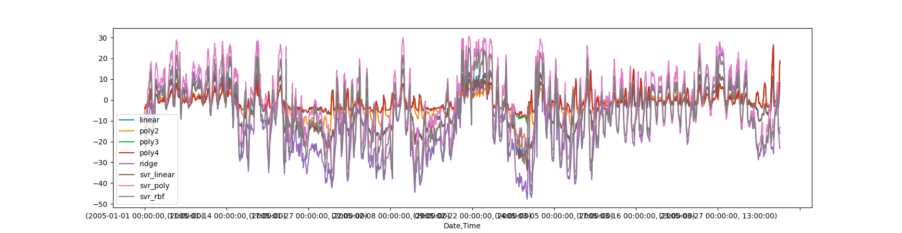

### regression-learning

this repository is used to restore my homework of  **Business Intelligence** 

I decide to make a survey about **regression analysis** , based on this opinion, i finished:

- [x] linear regression algorithm
- [x] muti variables linear regression algorithm
- [x] poly regression algorithm
- [x] muti variables poly regression algorithm
- [x] ridge regression algorithm
- [x] vector support regression with linear kernel algorithm
- [x] vector support regression with poly kernel algorithm
- [x] vector support regression with RBF kernel algorithm

thus , i make a compare among these algorithm using the air quality dataset of UCI dataset cluster, using these sophisticated methods to predict the value of RH :



********************************************************

a brief introduction to the directory structure:

```
AirQualityUCI --------the dataset
images             ---------the images to polish my article
src                     ----------the source code 
tex                     ----------the latex source code
```

#### Requirement

```shell
sudo pip3  install -r  ./requirements.txt
```

